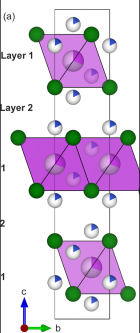

# Optimizing Lattice Energy in Irregular CM

Ethan Meltzer 
**UToledo REU 2023**

---
## Background
- Traditional solar panels use lead-based semiconductors (perovskites) like $\text{CH}_3\text{NH}_3\text{PbX}_3$
- ((Lead is bad)), and solar panels are only going to be more in demand

<!-- footer: https://www.energy.gov/eere/solar/perovskite-solar-cells -->

---

- Oct 2021, new research from University of Liverpool reports synthesis of lead-free semiconductor promising for photovoltaics, $\text{Cu}_2\text{AgBiI}_6$ 
- Paper reports irregular internal structure in addition to electronic properties, structure was analyzed using ChemDASH/VASP: serial minimization, slow
  - Parallelizing could mean more accurate results
- Worth researching: helps us understand why it's effective, could make commercial synthesis easier in future

<!-- footer: Journal of the American Chemical Society 2021 143 (10), 3983-3992 DOI: 10.1021/jacs.1c00495 -->

---

## The Goal

- Use *Vienna Ab-initio Simulation Package* (VASP) to simulate a 9-cell chunk of crystal using electron density functionals (DFT)
- Explore different feasible configurations of the crystal
- Determine which configurations result in the lowest lattice energies
- Verify that those configs produce similar electronic properties to measurements made in lab

---

## The problem

How can we find the global minimum of a discrete function with unpredictable behavior and a very large finite domain?

$${108 \choose 18}\text{Cu} * \left[{27 \choose 9} + {18 \choose 9}\right]\text{Ag/Bi} = 6.595 * 10^{26}\text{ configurations}$$

### Big number
- $\text{TB} = 10^{12}$ bytes, would need 600 trillion 1 TB storage drives to represent each configuration with 1 bit
- In meters, roughly the diameter of the observable universe 🪐🌌

<!-- footer: "" -->
---

## My approach

- Genetic algorithim converges on minimum while only looking at a small sample of the possible configurations
- Easily parallelizable, can run as many simulations as CPU threads available at once
- Use in this field is an active research area, especially with irregular materials

---

## First generation
- Some correlation between crystal symmetry/regularity and lattice energy in similar materials, many exceptions
- Skewing the first generation of configurations towards highly symmetric (high space group) configurations could lead to a faster convergence on a minimum.
- Accomplish this by binning the randomly generated first generation
  - Each bin is equal size but
  - Number of space groups represented in each bin varies

![bg right:35% 90%](https://attachments.office.net/owa/Ethan.Meltzer%40utoledo.edu/service.svc/s/GetAttachmentThumbnail?id=AAMkADI2YjEwNTRjLWY4NGEtNGQwNS1iMDllLTU2MmZmZTljOTAwYgBGAAAAAAD2jlADaB9eTKVmhznjNGdnBwBym1F%2BOK9ZTrCuJ1tgdtFlAAAAAAEMAABym1F%2BOK9ZTrCuJ1tgdtFlAAAMCnlxAAABEgAQAHh1%2BRfQNmhIkUr0WMCUvKY%3D&thumbnailType=2&token=eyJhbGciOiJSUzI1NiIsImtpZCI6IjczRkI5QkJFRjYzNjc4RDRGN0U4NEI0NDBCQUJCMTJBMzM5RDlGOTgiLCJ0eXAiOiJKV1QiLCJ4NXQiOiJjX3VidnZZMmVOVDM2RXRFQzZ1eEtqT2RuNWcifQ.eyJvcmlnaW4iOiJodHRwczovL291dGxvb2sub2ZmaWNlLmNvbSIsInVjIjoiYWI0OTJmZTM5Y2Q5NGFjMjk1OGU0MmViMmY1Mzc4ZDUiLCJzaWduaW5fc3RhdGUiOiJbXCJpbmtub3dubnR3a1wiLFwia21zaVwiXSIsInZlciI6IkV4Y2hhbmdlLkNhbGxiYWNrLlYxIiwiYXBwY3R4c2VuZGVyIjoiT3dhRG93bmxvYWRAMWQ2YjE3MDctYmFhOS00YTNkLWE4ZjgtZGVhYmZiM2Q0NjdiIiwiaXNzcmluZyI6IldXIiwiYXBwY3R4Ijoie1wibXNleGNocHJvdFwiOlwib3dhXCIsXCJwdWlkXCI6XCIxMTUzODAxMTI1MzU2MzMyMzk0XCIsXCJzY29wZVwiOlwiT3dhRG93bmxvYWRcIixcIm9pZFwiOlwiMThhZjEyMDUtYWU2ZC00ZDk0LTk1ZDItMTA0MDQxYWJjNjBjXCIsXCJwcmltYXJ5c2lkXCI6XCJTLTEtNS0yMS00Mjc1MjI2MTczLTMyNjA5NTA4MDktMzAzOTI1Nzc5Mi00Nzg5MjU1OFwifSIsIm5iZiI6MTY4NzM3MzQ5NywiZXhwIjoxNjg3Mzc0MDk3LCJpc3MiOiIwMDAwMDAwMi0wMDAwLTBmZjEtY2UwMC0wMDAwMDAwMDAwMDBAMWQ2YjE3MDctYmFhOS00YTNkLWE4ZjgtZGVhYmZiM2Q0NjdiIiwiYXVkIjoiMDAwMDAwMDItMDAwMC0wZmYxLWNlMDAtMDAwMDAwMDAwMDAwL2F0dGFjaG1lbnRzLm9mZmljZS5uZXRAMWQ2YjE3MDctYmFhOS00YTNkLWE4ZjgtZGVhYmZiM2Q0NjdiIiwiaGFwcCI6Im93YSJ9.pPnmrI8fxe6VkezRXgEWwMNv1FEZo1jSMBU6ZJpNi85lGh5WgoYO5TAi86OkZl_whToBPr9m8OlKv2hhTp0Vja6OG5FVjG56x27TpHKAdH-_sFBZk-grsXr4nKgobYW51I-U-bVtbbJISYapv_QMg-oqslAIWMZ_HWIsvQMuILnKjvnqiteuBiNcY9CVuqt7awnl0_6gyLvdGmMr7BiSeY2rP2jRy1-b30-gqQbSoWXbkhXa6qa_xhwTASARk4pb_NWK1NcaWi3j7Dt--9fbqnn7rmVwzyUtBq6Rfyq7cuQVBTUBG97bwz_vPv-cA--tTxpQJ4N8i7Z7MrxiMG7dWA&X-OWA-CANARY=EdQdOx-92kS0WDM9Y39YgdBYUY6IctsYpxBrNSP6FtT0dn0ue6l9A5-A-XWlAR2pA5UANk1Xd0w.&owa=outlook.office.com&scriptVer=20230609005.14&animation=true)

---

## Generating child configurations
- Configs for future generations are generated from the best of the previous generation
- Crossover: site filling is determined by indexing the occupied sites of the parents and selecting at random
- Mutation: A few occupied atomic sites in the child configuration will be swapped with ones chosen at random, most often resulting in an atom switching with a vacancy.