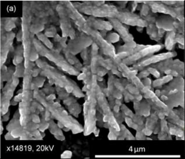
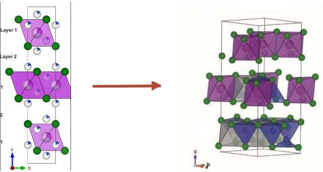
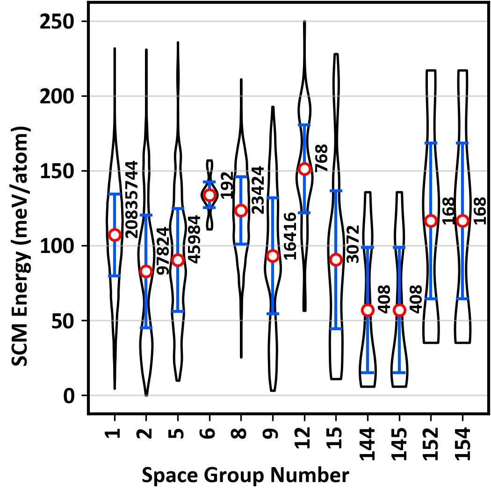
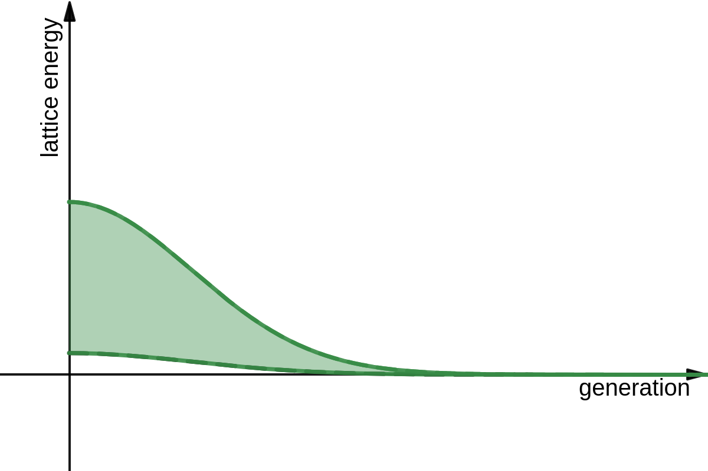

# Optimizing Lattice Energy in Site-Disordered $\text{Cu}_2\text{AgBiI}_6$

Ethan Meltzer -- Oberlin College Dept. of Comp. Sci.
*Dr. Sanjay V. Khare, Dr. Richard Irving, Mr. Victor T. Barone -- University of Toledo Dept. of Physics*
**University of Toledo REU in Physics 2023**

<!-- Introduce yourself and the research team and say the title of the presentation -->
<!-- "Today I will be discussing my research on..." -->

---

## Background

- Lead-free semiconductor synthesized at University of Liverpool in 2021 has promising applications in photovoltaics: near-onset absorption coeff. of $1.0 \times 10^5\text{ cm}^{-1}$*, order of magnitude greater than $\text{Si**, CdTe***}$
- Initial research focus on electronic and optical properties, did 250 VASP calculations for 4 configurations, we will be looking at order $10^5$ configs in first gen. of simulations

<!-- footer: "*, fig. Harry C. Sansom et al.\nJournal of the American Chemical Society 2021 143 (10), 3983-3992 DOI: 10.1021/jacs.1c00495\n**  Martin A. Green and Mark J. Keevers. Progress in Photovoltaics: Research and Applications, Vol. 3, 189-192 (1995)\n***  Rangel-Cárdenas J, Sobral H.Materials (Basel). 2017 Jun 1;10(6):607. doi: 10.3390/ma10060607." -->

<!-- Start by discussing the SEM image -->
<!-- Make sure to mention Harry Sansom et al. from ULiverpool -->
<!-- Make sure to say full name of VASP (Vienna Ab-initio Simulation Package) and what it does (DFT modelling, useful for many atom systems) -->

---

<!-- footer: ""-->

<!-- Explain what we're looking at! Pink enclosing large tricolor circles => Iodine in an octahedra around either a silver, bismuth, or vacancy. White and blue PAC-MAN is ~1/6 Cu, ~5/6 vacancy -->
<!-- Mention these figures from initial paper -->
<!-- Mention that right is a different perspective, is a 3x3 combination of left, and that it is a determined config instead of probabilistic overview -->

---

## Combinatoric Complexity

How can we efficiently find the global minimum of a discrete function with unpredictable behavior and a very large finite domain?

$${108 \choose 18}\text{Cu} * \left[{27 \choose 9} * {18 \choose 9}\right]\text{Ag/Bi} = 3.173 * 10^{31}\text{ configurations}$$

### Big number
- $\text{TB} = 10^{12}$ bytes, would need 4 quintillion 1 TB storage drives to represent each configuration with 1 bit
- Must only interact with a very small fraction of the population.

<!-- footer: "" -->
<!-- Walk through the equation -->

---

## Genetic Algorithmic Approach

- Converges on minimum while only looking at a small sample of the possible configurations
- Individual simulations embarrassingly parallel, can run ~50 simultaneously on UToledo servers compared to inherently serial simulated annealing approach in initial research
- Evaluating efficacy in this field is an active research area, especially with site-disordered materials

<!-- Start by introducing the concept of genetic algorithim and walk through the flowchart -->
<!-- Talk about how in addition to discovering things about the material, we are also figuring out how to get genetic algs to perform optimally for this sort of problem. -->

---

# Thank you!

*emeltze@rockets.utoledo.edu*

<!-- Thank NSF and UToledo for supporting the research and for everyone for coming! -->

---
## Acknowledgements and References

**Research Team:** Dr. Sanjay V. Khare\*, Dr. Richard Irving\*, Mr. Victor T. Barone\*
\
**Highly Absorbing Lead-Free Semiconductor Cu2AgBiI6 for Photovoltaic Applications from the Quaternary CuI–AgI–BiI3 Phase Space**
*Harry C. Sansom et al.*
Journal of the American Chemical Society 2021 143 (10), 3983-3992
DOI: 10.1021/jacs.1c00495 

<!-- footer: "* University of Toledo Department of Physics" -->

---

## First generation
- Some correlation between crystal symmetry/regularity and lattice energy in similar materials, many exceptions
- Skewing the first generation of configurations towards highly symmetric (high space group) configurations could lead to a faster convergence on a minimum.
- Accomplish this by binning the randomly generated first generation
  - Each bin is equal size
  - Number of space groups represented in each bin varies

<!-- footer: "Fig. from active research in Khare group" -->

---

## Generating child configurations
- Configs for future generations are generated from the best of the previous generation
- Crossover: site filling is determined by indexing the occupied sites of the parents and selecting at random
- Mutation: A few occupied atomic sites in the child configuration will be swapped with ones chosen at random, most often resulting in an atom switching with a vacancy.

<!-- footer: "" -->
